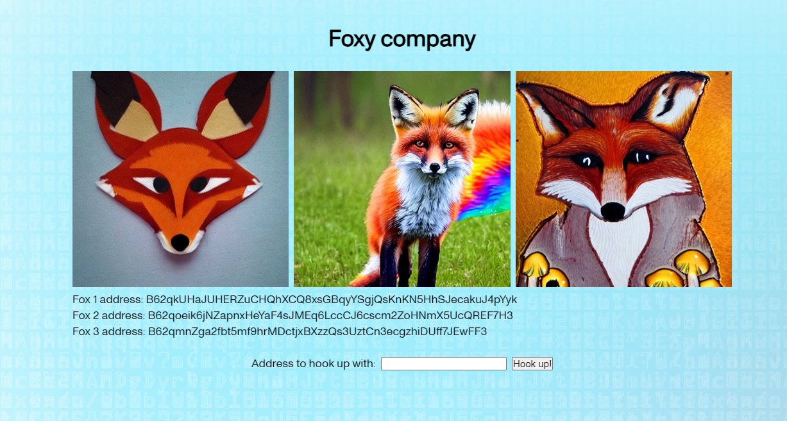

# Foxy company

This is a zkApp for finding yourself some foxy company for tonight.

The site gives you a few options from which to choose. If the chosen fox also chooses you, it's a match made in fox heaven.

All information is secured by Zero Knowledge technology and votes are private.

## Developer DAO hackathon

This is an entry in the [Developer DAO hackathon](https://lu.ma/jypdmapk) for Mina blockchains.

## Finer details

The app doesn't work.

## Even finer details

This project aimed to build a website and a circuit, and connect them together via a browser wallet.

Unfortunately, following various Mina tutorials and examples, I was unable to get the UI to work with a wallet. Different examples use different versions of things, and all example code seems to be outdated. Furthermore, I was unable to find a working React UI From the [examples provided](https://zkappsformina.com/).

The circuit and its unit tests somewhat work, but it's also possible that the circuit doesn't work exactly as intended. The circuit was also successfully deployed at Berkeley testnet, at address B62qpHJ1XKAJFuubmiMXeTzSGGViDnQtmJ8cvJMRWh6Z2VAiRQfGPZK .

In any case, I learned a lot of Mina while doing this, which was also my original target.
